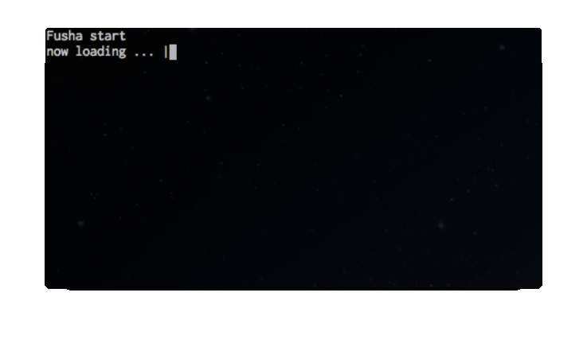

==============================
progressline.py
==============================

くるくる回るプログレスバー(ただし、進行度合は表示されない。くるくる回るだけ)

インストール
-------------

.. code-block:: python

    $ python setup.py install

使い方
--------

with 文の中に待つ処理を書きます。

.. code-block:: python

    import time

    print('start get application')
    with ProgressLine(0.12, title='now loading ...'):
        time.sleep(3)
    print('finish')

実行結果は

.. code-block:: sh

    start get application
    now loading ... done
    finish

サンプル
---------

